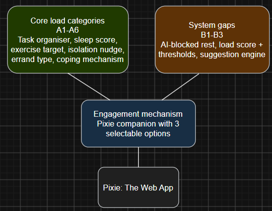
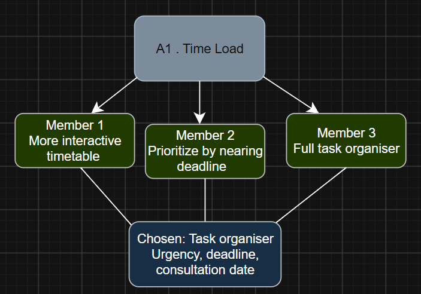
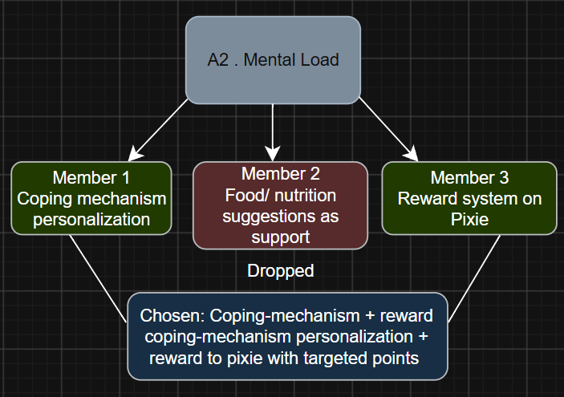
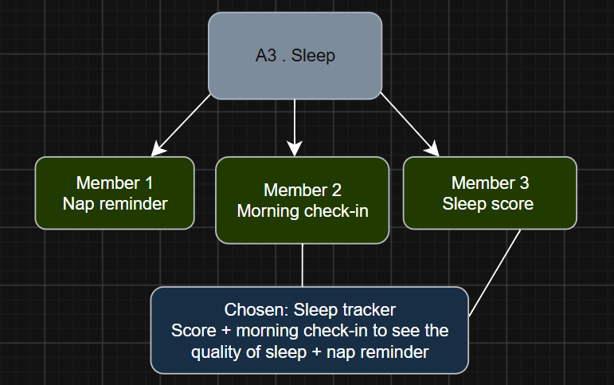
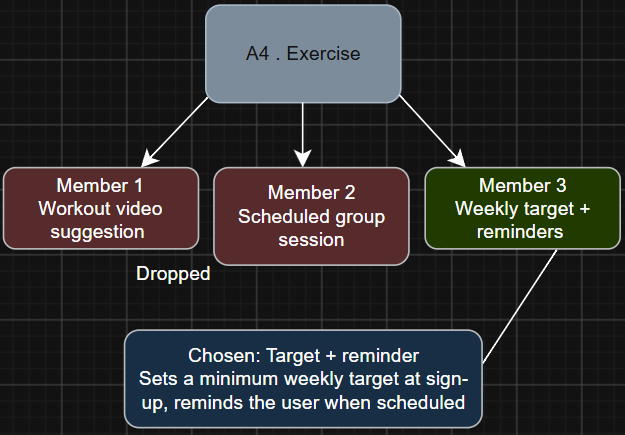
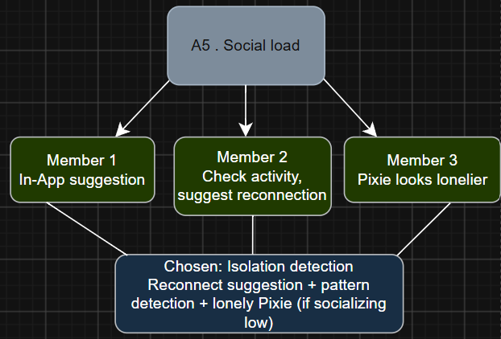
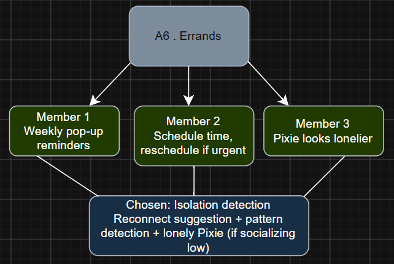
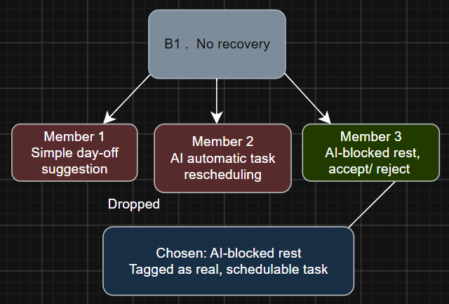
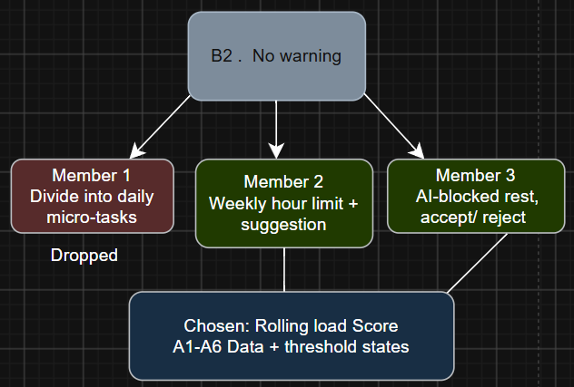
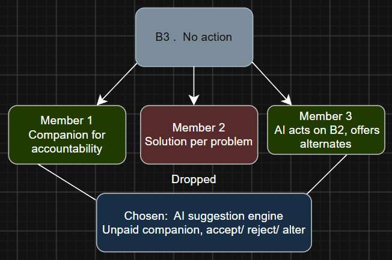

# Pixie by TriCip

**Team:** Amira Shazleena binti Ahmad Shamsudin, Wan Nur Aliya binti Wan Noor Azhar, Nurul Najihah binti Abdullah  
**Problem Statement:** Stress & Workload Manager  
**Video Presentation:** https://youtu.be/0Q3X5QMXGkE  
**Presentation Slides:** https://canva.link/n044iqs7y2g6qpw  

---

## 1. Project Overview

### The Problem

As students, we often juggle academics, club commitments, and personal life, accumulating stress until we finally burn out. Looking at our own experience, the stress mainly comes from five distinct areas: mental, time, physical, social, and errands. Mental load is caused by constant context switching between commitments, while time load brings improper deadline handling. These also carry the physical load, including poor sleep quality and lack of exercise. As for social load, gradual isolation is expected, and the errands load gets silently deprioritised since it's non-academic life admin that has no deadline. Individually, these loads seem manageable, but when combined and left untracked, they compound silently until burnout is already underway.

The key stakeholders are university students who are actively juggling academics alongside club, society, or committee commitments where deadlines and obligations come from multiple sources.

Task managers like Notion organise deadlines and to-do lists but have no sense of the students' actual state and wellbeing. Wellness apps like Headspace use biometric data to detect moments of stress and prompt a breathing exercise but are entirely disconnected from the coursework, deadlines, or commitments that are actually driving that stress. Neither app combines what's happening across a student's academic and personal life into one understanding of their overall load.

### Our Solution

We build a burnout-prevention web app that fuses students' mental, time, physical, social, and errand load into one combined signal with our customizable companion named Pixie, whose state reflects the users' wellbeing without requiring them to open a dashboard. When load crosses a threshold, it proactively suggests a specific, user-approved action such as rescheduling a task, blocking recovery time, or a reminder for reconnection with a friend. The user always retains control, and every suggestion can be accepted, rejected, or adjusted.

**Feature set:**
- Task organiser with urgency, deadlines, time left, and non-academic "errand" tasks
- Daily check-in (sleep, exercise, mood, social connection) feeding a load score
- Companion (Pixie) that visually reflects the user's combined load state
- Early warning system detection
- AI-generated suggestions tied to the warning state (reschedule / rest / reconnect)

---

## 2. Ideation & Process

### 2.1 Ideas We Considered

*Chosen ideas listed first.*

| Idea | Why it was dropped / kept |
|---|---|
| Task organiser with urgency, deadline, consultation date, task type | Kept: All three members independently gave the same idea; helps the user actually manage their tasks |
| Pixie companion (3 selectable options) as the core engagement mechanism | Kept: Gives the user a reason to check in daily (not guilt-based) and doubles as the app's ambient signal (Pixie's state reflects the user's current state) |
| Coping-mechanism personalisation + reward/motivation system | Kept: Combines two of the three proposed mechanisms — asking the user their coping style during sign-up, then reinforcing it with small rewards to Pixie as targeted points are achieved |
| Sleep tracker + morning sleep score | Kept: Simple to build, clear signal |
| Exercise target + reminder system | Kept: Sets a minimum weekly target at sign-up, reminds the user when scheduled — simpler to build than a scheduled group session |
| Isolation detection (low mood + no social activity) → reconnect suggestion + Pixie looks lonelier | Kept: Three members independently proposed an identical mechanism for social load |
| Errand as a lightweight, no-deadline task type | Kept: Distinct enough from deadline tasks to warrant its own type |
| AI-blocked rest time, tagged as a real task | Kept: Makes recovery a scheduled, visible item in calendar space instead of something silently skipped |
| Load score from daily check-in, threshold-based warning | Kept: The "early warning" core of the app |
| AI suggestion acting on warning state & user schedule | Kept: Makes sure the app doesn't just track and report |
| Food/nutrition suggestions for mental load | Dropped: Out of scope for a burnout app since it's closer to a diet-tracking feature |
| Simple single day-off suggestion for recovery | Dropped: Too vague — doesn't fit around deadlines still needing attention |
| Workout videos / scheduled group workout session | Dropped: Video suggestions are too passive to verify or track |
| Fully automatic AI task rescheduling | Dropped: Removes user control / unpredictable output |

### 2.2 Ideation Boards

*High-level view of how our three idea groups — core load categories, systemic gaps, and the engagement mechanism — combine into one product.*

*A1 (time load): all three members' proposals converged in direction — the task organiser was chosen as the most concrete, buildable version.*

*A2 (mental load): the coping-mechanism idea and reward system were combined; the food/nutrition suggestion was dropped as out of scope for a workload app.*

*A3 (sleep): all three proposals blended directly into the final feature — sleep score, morning check-in, and power-nap suggestion.*

*A4 (exercise): a genuine three-way fork — the target-and-reminder system was chosen over a passive video suggestion and a coordination-dependent group session.*

*A5 (social load): near-identical mechanism proposed independently by all three members — one of our strongest convergence signals.*

*A6 (errands): all three converged on treating errands as their own lighter-weight task type.*

*B1 (no recovery scheduled): real divergence in scale — a full day off, in-session breaks, or AI-scheduled rest blocks. AI-blocked rest was chosen for treating rest as a genuine, schedulable calendar item.*

*B2 (no early warning): the threshold concept and cross-data approach combined directly into the rolling load score.*

*B3 (tracking without action): the companion framing and AI-suggestion mechanism combined into the final action-based approach.*

*[TEAM: add raw whiteboard/paper sketch photos here too if you have them.]*

### 2.3 Mentor Consultation

| Date | Mentor | Feedback Received | What Was Changed |
|---|---|---|---|
| 7 September 2026 | Teh Ming En | Don't show all the notifications | Only important notifications (needed) will be shown |
| 7 September 2026 | Teh Ming En | Add a notification box in the web app | Added a suggestion tab for the user to see recommended actions for the day |
| 7 September 2026 | Teh Ming En | Make sure tasks that have passed the deadline also get reminded | The task that hasn't been marked done gets a reminder |
| 9 September 2026 | Khor Jia Quan | Only the critical things need to be notified to the user | Put some of the notifications that need to be notified only in the web app homepage/recommendation tab |
| 9 September 2026 | Khor Jia Quan | Make it less annoying for the user to check in their daily score | Give a pop-up/check-in tab to the user when they first open the application instead of continually reminding them |
| 9 September 2026 | Khor Jia Quan | Improve the overall design | Altered the UI and changed some of the colour theme |
| 11 September 2026 | Varsha Selvakumar | Suggested that an application version would be better | No changes — building a web app is easier for us as beginners |
| 11 September 2026 | Varsha Selvakumar | Recommended some tips for the pitch | Altered the content in our presentation |

---

## 3. Design & Prototype

**UI Prototype:** [Public Link]

*[TEAM: embed or link 4–8 key screens as images, with a caption on each explaining the interaction. Check the prototype opens in an incognito window.]*

---

## 4. What Makes It Different

### 4.1 Pixie's Features

| Feature | What's different |
|---|---|
| Adaptive Personal Companion (Pixie) | Traditional applications usually offer only simple features that help organise tasks and display them. However, Pixie acts as an emotional indicator through its appearance and state changes based on the user's combined workload, sleep, mood, and social activity — allowing the user to notice burnout signs naturally |
| Combined burnout and load score | Traditional applications also focus on deadlines and completion status. Pixie combines all five workload dimensions — mental, time, physical, social, and errands load — to understand the user's overall condition |
| Early burnout warning system | Instead of reacting after burnout, Pixie identifies increasing stress patterns through daily check-ins, task behaviours, and sleep patterns, then provides early suggestions before the user reaches exhaustion |
| Action-based AI suggestions | Wellness applications usually provide general advice such as meditation or relaxation. Pixie provides personalised actions connected to the user's actual schedule, such as rescheduling tasks, adding recovery time, or reconnecting socially |
| Recovery as a real task | Pixie treats rest and recovery as important scheduled activities, not optional ones users often ignore — changing recovery from "free time" into a manageable part of productivity |
| User-controlled assistance | Unlike fully automatic AI systems, Pixie does not force changes. Users can accept, reject, or modify every suggestion, keeping control over their own decisions |

### 4.2 Comparison with Existing Solutions

| Existing Solution | Limitation of others | Pixie's Improvement |
|---|---|---|
| Task management apps like Notion and Todoist | They only organise tasks but do not understand the user's wellbeing | Combines tasks with wellbeing data to be analysed |
| Wellness apps like Headspace and meditation apps | They focus on relaxation but are disconnected from the source of stress | Connects wellbeing with academic and personal workload |
| Calendar apps | Show schedule but cannot identify overload | Detects workload imbalance and suggests adjustments |
| Psychology-informed self-discovery platforms like ThePsychLens | Analyse psychological conditions through assessment and reflection but lack connection with daily responsibilities | Integrates task workload and wellbeing signals across five dimensions to provide early burnout detection and personalised actions |

---

## 5. Technical Architecture & Feasibility

### 5.1 Tech Stack

| Component | Technology | Purpose / Why chosen |
|---|---|---|
| Frontend | HTML, CSS, JavaScript | Used to develop Pixie's web interface, including dashboard, task management, daily check-in, and companion interaction features. Allows rapid implementation of the Figma prototype |
| Backend | Node.js + Express.js | Handles communication between the frontend, database, and AI service. Manages application logic, user requests, and data processing |
| Database | PostgreSQL (hosted on Aiven) | Stores structured user data including accounts, tasks, deadlines, daily wellbeing check-ins, workload scores, and Pixie states. PostgreSQL was chosen for its reliability with relational data; Aiven provides cloud hosting for remote access and scalability |
| AI service | OpenAI API | Generates personalised burnout management suggestions based on the user's workload information, task schedules, and wellbeing data |
| Frontend hosting | Vercel | Hosts the web application and provides easy deployment through GitHub integration |
| Backend hosting | Render | Deploys and runs the Node.js + Express.js backend API |
| Development tools | VS Code, Git, GitHub, Live Server | Supports the software development workflow — coding environment, local testing, version control, and team collaboration |

### 5.2 Expected Constraints

| Technology Used | Constraint Explanation |
|---|---|
| OpenAI API | API usage depends on external service availability, and each request consumes API credits, which could make unlimited AI suggestions costly |
| Aiven PostgreSQL | Free cloud database resources have limits on storage, connections, and performance as the number of users grows |
| Cloud Hosting | Free hosting platforms may have limited computing resources and slower response times during high traffic |
| User wellbeing data storage | Storing mood, sleep, and workload information requires careful handling due to privacy concerns |
| Rule-based Burnout Score | Initial burnout assessment relies on predefined rules and user input, which may not represent each user's experience accurately |

### 5.3 System Architecture Diagram

*[TEAM: add diagram here]*

### 5.4 Build Plan & Scope

During the building phase, we will focus on developing a functional MVP of Pixie that demonstrates early burnout awareness through workload tracking, wellbeing check-ins, and personalised suggestions. The main features we plan to build are:

**1. Task Management System**
- Allow users to create and manage academic, personal, and errand-related tasks
- Store task details such as urgency, deadline, and completion status
- Use task information to understand the user's time workload

**2. Daily Wellbeing Check-in**
- Allow users to record: sleep quality, mood, exercise level, social connection
- Use these inputs as indicators of the user's overall wellbeing state

**3. Burnout Load Analysis**
- Combine task data and wellbeing inputs to calculate a workload score
- Analyse five workload dimensions: mental, time, physical, social, and errand load
- Classify the user's current condition into different Pixie states

**4. Pixie Companion Feedback**
- Develop Pixie's visual state changes based on the user's workload condition
- Provide users with an easy-to-understand indication of their current wellbeing status

**5. AI-Powered Suggestions**
- Integrate the OpenAI API to generate personalised recommendations
- Suggestions may include: adjusting task priorities, scheduling recovery time, encouraging social reconnection

Due to the limited hackathon timeframe, we will **not** implement:
- Advanced machine learning burnout prediction model
- Wearable device integration
- Full mobile application
- Long-term psychological diagnosis
- Automatic task rescheduling without user approval

These features can be considered for future development after validating the MVP.
